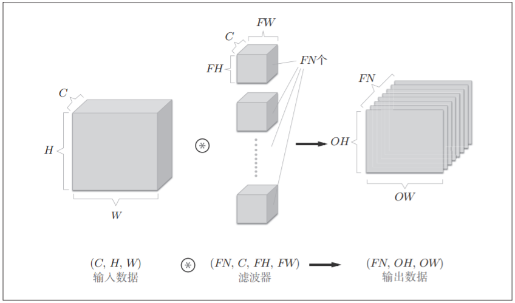
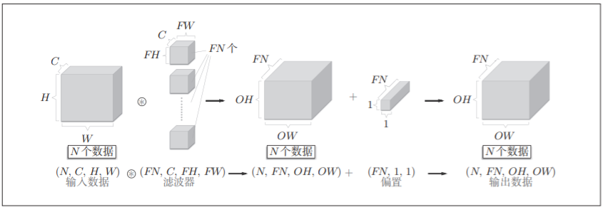

## CNN
### 名词介绍
- Affine层——当成矩阵相关的线性运算即可
- 卷积层(Convolution层)池化层(Pooling层)
- 卷积层结构：
> 1. 将卷积层的输入数据称为输入特征图
> 2. 将卷积层输出数据成为输出特征图
- 卷积运算：
> 1. 滤波运算——成绩累加运算+偏置
> 2. 填充对周围大小都扩充1，即从(4,4)变成(6,6)，为了调整输出的大小，保持矩阵的Size不变
> 3. 步幅，默认为1，但是可以设为2，即隔着两个格子  

- 综上，增大步幅后，输出大小会变小。而增大填充后，输出大小会变大。如果将这样的关系写成算式，会如何呢？接下来，我们看一下对于填充和步幅，如何计算输出大小。
- 这里，假设输入大小为(H, W)，滤波器大小为(FH, FW)，输出大小为
(OH, OW)，填充为P，步幅为S。此时，输出大小可通过进行计算
$$ OH=\frac{H+2P-FH}{S}+1 \\ 
 OW=\frac{H+2P-FW}{S}+1$$
- 3维数据当成多维数组来表示即为(channel,height,width)=(C,H,W)

- 批处理：
> 将在各层间传递的数据保存为4维数据——(batch_num,channel,height,width)

- 池化层(Pooling)
- 与之前卷积层的卷积运算一样：1.步幅，2.目标区域，“2×2”表示目标区域大小。3.一般来说，池化窗口大小会和步幅设定成相同的值。
池化层特征：
1. 没有要学习的参数：池化层和卷积层不同，没有需要学习的参数，池化只是从目标区域中取最大值或者平均值不存在要学习的参数。
2. 通道数不会发生变化，经过池化运算，输入数据和输出数据的通道数不会发生变化。
3. 对微小的位置变化具有鲁棒性：输入数据发生微笑偏差时，池化仍会返回相同的结果。因此池化对于输入数据的微小偏差具有鲁棒性。
> - Max pooling是指取目标区域最大值的运算
> - Average池化计算目标区域的平均值
